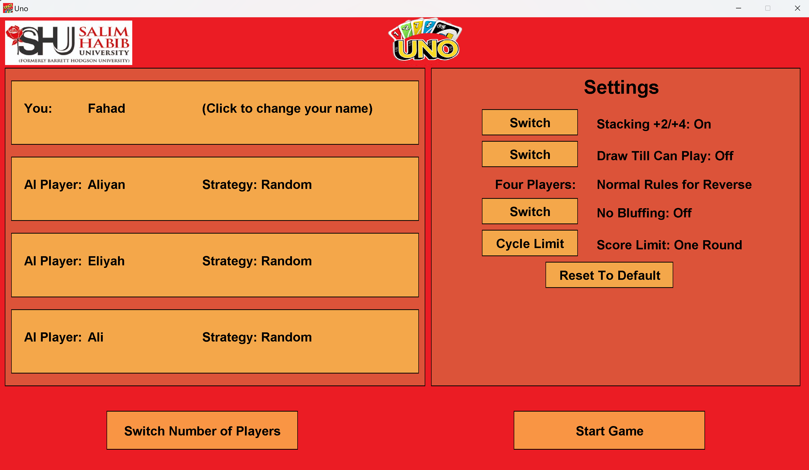
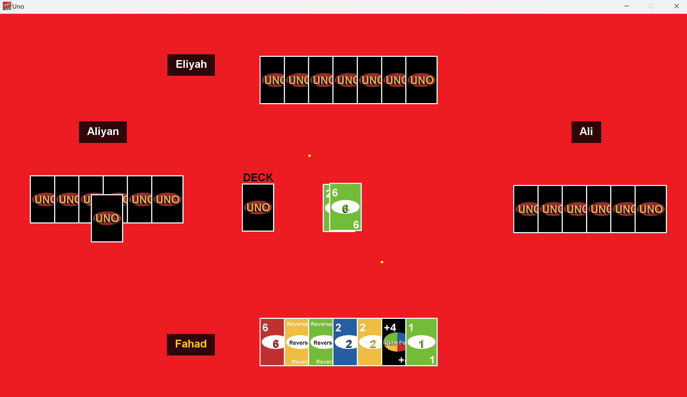
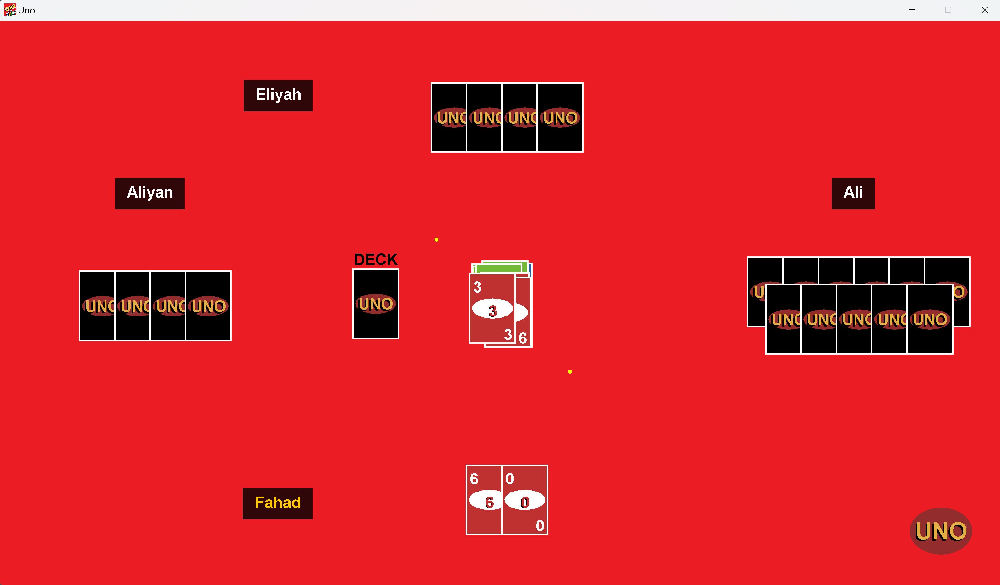
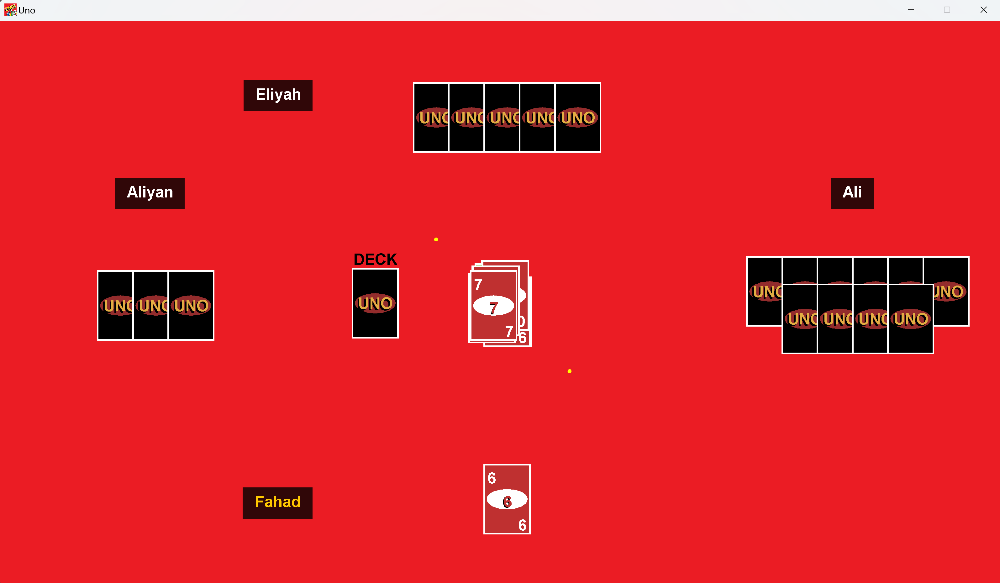
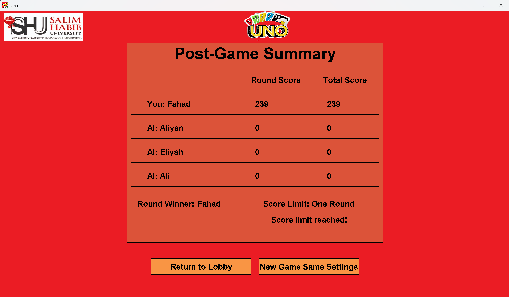
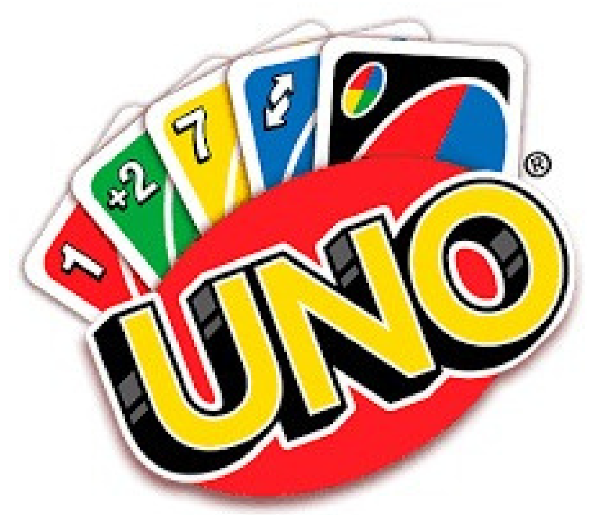

# 🎮 UNO Card Game


## 📌 Overview
Dive into the digital version of the classic UNO card game! This version follows the traditional rules, offering an engaging experience with multiplayer and intelligent AI opponents. Get ready to strategize and shout **"UNO!"** to claim victory!  

---

## ✨ Features
- 🎭 **Multiplayer Support** - Compete against friends or challenge strategic AI players.  
- 🃏 **Authentic UNO Rules** - Classic gameplay with action-packed moments.  
- 🚀 **Special Action Cards** - Skip, Reverse, Draw Two, Wild, and Draw Four Wild for strategic plays.  
- 🤖 **Intelligent AI** - Dynamic AI strategies to keep the game competitive.  
- 🎮 **Interactive Gameplay** - Engaging UI with animations and smooth transitions.  
- 🔊 **Sound Effects** - Enhanced gaming experience with playful sounds.  

---

## 🛠 Technologies Used
- ☕ **Java** - Core programming language for game logic and UI.  
- 🎨 **Swing** - Used for building the graphical user interface.  
- 🧩 **Object-Oriented Programming (OOP)** - Modular design for maintainable and reusable code.  
- 📚 **Data Structures** - Utilizes ArrayList, HashMap, and List for efficient game state management.  

---

## 📂 File Structure
```plaintext
UNO-Card-Game/
│── Images/
│   │── screenshot1.png
│   │── screenshot2.png
│   │── screenshot3.png
│   │── screenshot4.png
│   │── screenshot5.png
│   │── screenshot6.png
│   │── screenshot7.png
│── out/production/Uno/
│   │── META-INF/
│   │── *.class (Compiled Java bytecode)
│── src/
│   │── AIPlayer.java
│   │── Card.java
│   │── Deck.java
│   │── Game.java
│   │── GamePanel.java
│   │── Player.java
│   │── RuleSet.java
│   │── WndInterface.java
│   │── ... (Other supporting Java classes)
│── AINameList.txt
│── UNO_.png
│── UNO_logo.jpg
│── UNO_logo.png
│── SHU_LOGO.jpg
│── LICENSE
│── Uno.iml
│── README.md
```

---

## 🎮 Gameplay
1. **Setup**: Each player is dealt 7 cards.  
2. **Objective**: Be the first to play all your cards.  
3. **Matching**: Match the top card of the discard pile by color or number.  
4. **Special Action Cards**:  
   - 🔄 **Reverse**: Reverses the order of play.  
   - ⏭ **Skip**: Next player loses their turn.  
   - ➕ **Draw Two**: Next player draws 2 cards and loses their turn.  
   - 🌈 **Wild**: Player chooses the color to continue.  
   - 🎨 **Draw Four Wild**: Choose the color and the next player draws 4 cards.  
5. **UNO Call**: When you have one card left, shout **"UNO!"** or face a penalty.  
6. **Winning**: The first player to get rid of all their cards wins!  

---

## 📸 Screenshots
### 🖥️ Main Menu


### 🎲 Game Interface






### 🏆 Player Winning Screen


---

## 🚀 How to Run
1. **Clone the Repository**:  
   ```sh
   git clone https://github.com/yourusername/UNO-Card-Game.git
   ```
2. **Navigate to the Project Directory**:  
   ```sh
   cd UNO-Card-Game
   ```
3. **Open in an IDE**: Use an IDE like IntelliJ, Eclipse, or VS Code with Java support.  
4. **Compile and Run**:  
   - Compile the source files from the `src` directory.  
   - Run the `Game.java` file to start the game.  

---

## 💡 Future Enhancements
- 🌐 **Online Multiplayer Mode** - Connect and play with friends online.  
- 📲 **Mobile Version** - Port the game to Android and iOS.  
- 🎨 **Customizable Themes** - Unlockable card designs and backgrounds.  
- ⚙️ **Settings Menu** - Adjust sound, animations, and gameplay speed.  

---

## 📄 License
This project is licensed under the MIT License. See the [LICENSE](LICENSE) file for more details.  

---

## 🤝 Contributing
Contributions are welcome! Feel free to open issues or submit pull requests.  

---

## 📧 Contact
For any questions or suggestions, feel free to reach out:  
- **Muhammad Fahad Imdad**  
- 📧 **Email**: [fahadimdad966@gmail.com](mailto:fahadimdad966@gmail.com)  
- 🔗 **LinkedIn**: [Muhammad Fahad Imdad](https://www.linkedin.com/in/muhammad-fahad-imdad)  
- 🐙 **GitHub**: [FahadImdad](https://github.com/FahadImdad)  

---

## 🎉 Acknowledgments
- Inspired by the classic UNO card game by Mattel.  
- Special thanks to open-source communities and contributors.  


